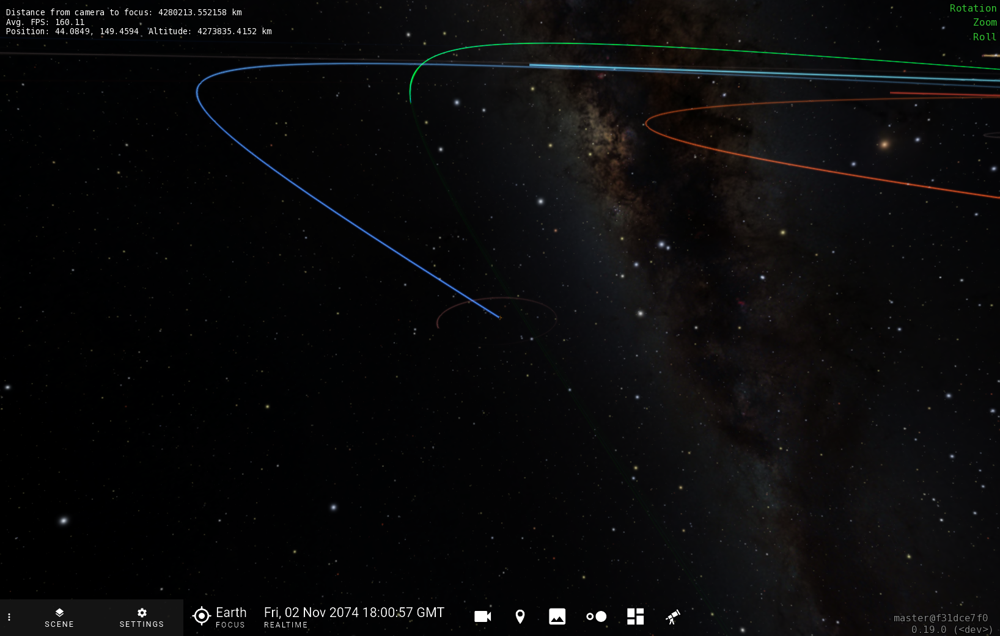

### OpenSpace Project - Orbital Uncertainty Visualization



To install the required packages:

```shell
pip install --user -r requirements.txt
```

If using `conda`, a fresh environment can be made with a command like:
```shell
conda create -n openspace_py310 python=3.10 
conda activate openspace_py310
pip install -r requirements.txt
```

To be able to propagate orbits, you will need to install PYOORB via conda:
```shell
conda install -c conda-forge openorb
```

However, this repository already comes with a pre-computed set of orbit propagations for a few objects.

To run the orbit fitting notebook, you will need to install the [`find_orb` software](https://github.com/Bill-Gray/find_orb). See this [Dockerfile](https://github.com/Bill-Gray/find_orb/blob/master/Dockerfile) for instructions on how to install find_orb. 

### Objects of Interest

- [2012 DA14](https://ssd.jpl.nasa.gov/tools/sbdb_lookup.html#/?sstr=2012%20DA14) (NEO)  
    Small ~20 m asteroid that passed within ~28,000 km of the Earth's surface on February 15, 2013. This is within the orbital distance of geosynchronous satellites. After this close approach, the orbital class of this object changed from Apollo to Aten.

- [2020 VW](https://ssd.jpl.nasa.gov/tools/sbdb_lookup.html#/?sstr=2020%20VW) (NEO - Potential Impactor)  
    Small ~1 m asteroid with a [cumulative impact probability of 1 in 140](https://cneos.jpl.nasa.gov/sentry/details.html#?des=2020%20VW). First potential impact occurs on November 2, 2074.

- [2000 SG344](https://ssd.jpl.nasa.gov/tools/sbdb_lookup.html#/?sstr=2000%SG344) (NEO - Potential Impactor)  
    A ~40 m asteroid with a [cumulative impact probability of 1 in 370](https://cneos.jpl.nasa.gov/sentry/details.html#?des=2000%20SG344). First potential impact occurs on September 18, 2069. This asteroid exhibis interesting bifurcation with several potential impacts occuring in September 2071.

- [2023 CX1](https://ssd.jpl.nasa.gov/tools/sbdb_lookup.html#/?sstr=2023%20CX1) (NEO - Imminent Impactor)  
    An small ~1 m immenent impactor discovered a few hours before impact over the English channel on February 13, 2023. 

- [2004 MN4](https://ssd.jpl.nasa.gov/tools/sbdb_lookup.html#/?sstr=apophis)  (NEO/PHA)  
    A ~370 m potentially hazardous asteroid with a close approach occuring on April 13, 2029. During this close approach, Earth will perturb the orbit enough to change the orbit class from Apollo to Aten. This is the closest approach of an asteroid of this size in recorded history and it will be visible to the naked eye. 